# Polly Bot - Complete Architecture Diagram

```mermaid
%%{init: {'theme': 'dark', 'themeVariables': { 'primaryColor': '#bb86fc', 'primaryTextColor': '#ffffff', 'primaryBorderColor': '#bb86fc', 'lineColor': '#03dac6', 'secondaryColor': '#3700b3', 'tertiaryColor': '#1e1e1e', 'background': '#121212', 'mainBkg': '#1e1e1e', 'nodeBorder': '#bb86fc', 'clusterBkg': '#2d2d2d', 'clusterBorder': '#bb86fc', 'titleColor': '#ffffff', 'edgeLabelBackground': '#1e1e1e'}}}%%

flowchart TB
    subgraph ENTRY["**ENTRY POINTS**"]
        direction TB
        MAIN["main.py<br/>Entry Point"]
        DISCORD_EVENT["Discord Events<br/>@mention / reply / context menu"]
        WEBHOOK_IN["GitHub Webhook<br/>@mention in issues/PRs"]
    end

    subgraph DISCORD_LAYER["**DISCORD LAYER** - src/bot.py"]
        direction TB
        POLLYBOT["PollyBot<br/>(commands.Bot)"]

        subgraph EVENTS["Event Handlers"]
            ON_READY["on_ready()"]
            ON_MESSAGE["on_message()"]
            ASSIST_CTX["@assist_context_menu"]
        end

        subgraph MSG_FLOW["Message Processing"]
            START_CONV["start_conversation()<br/>Create thread"]
            HANDLE_THREAD["handle_thread_message()<br/>Thread responses"]
            PROCESS_MSG["process_message()<br/>Main processing"]
            FETCH_HISTORY["fetch_thread_history()<br/>Discord memory"]
        end

        subgraph ADMIN["Admin System"]
            IS_ADMIN["is_admin()<br/>Role-based check"]
            ADMIN_ROLES["admin_role_ids<br/>from config"]
        end

        subgraph TASKS["Background Tasks"]
            CLEANUP_SESSIONS["cleanup_sessions<br/>1 min loop"]
            CHECK_STALE["check_stale_terminals<br/>15 min loop"]
        end
    end

    subgraph CONFIG_LAYER["**CONFIGURATION** - src/config.py + src/constants.py"]
        direction TB
        CONFIG["Config class<br/>config.json + .env"]

        subgraph CONFIG_VALS["Config Values"]
            DISCORD_TOKEN["discord_token"]
            GITHUB_APP["github_app_id<br/>github_private_key<br/>installation_id"]
            WEBHOOKS["webhook_port<br/>webhook_secret"]
            AI_CFG["pollinations_model<br/>pollinations_token"]
            FEATURES["sandbox_enabled<br/>local_embeddings_enabled"]
        end

        subgraph CONSTANTS["Constants - Tool Definitions"]
            GITHUB_TOOLS["GITHUB_TOOLS<br/>github_issue, github_pr<br/>github_project, github_custom<br/>github_overview"]
            CODE_SEARCH["CODE_SEARCH_TOOL"]
            WEB_SEARCH["WEB_SEARCH_TOOL"]
            WEB_SCRAPE["WEB_SCRAPE_TOOL"]
            POLLY_AGENT["polly_agent tool"]
        end

        subgraph SECURITY["Security Filters"]
            ADMIN_ACTIONS["ADMIN_ACTIONS<br/>per-tool admin sets"]
            FILTER_ADMIN["filter_admin_actions_from_tools()"]
            FILTER_INTENT["filter_tools_by_intent()<br/>Regex matching"]
            TOOL_KEYWORDS["TOOL_KEYWORDS<br/>Compiled patterns"]
        end

        SYSTEM_PROMPT["TOOL_SYSTEM_PROMPT<br/>Knowledge rules<br/>API guidance<br/>polly_agent rules"]
    end

    subgraph AI_LAYER["**AI LAYER** - src/services/pollinations.py"]
        direction TB
        POLL_CLIENT["PollinationsClient"]

        subgraph AI_METHODS["Core Methods"]
            PROCESS_TOOLS["process_with_tools()<br/>Main entry"]
            CALL_WITH_TOOLS["_call_with_tools()<br/>Tool loop (max 20)"]
            CALL_API["_call_api_with_tools()<br/>HTTP to API"]
            EXEC_PARALLEL["_execute_tools_parallel()<br/>Parallel execution"]
        end

        subgraph AI_FEATURES["Features"]
            RESPONSE_CACHE["ResponseCache<br/>60s TTL"]
            RETRY_LOGIC["Retry Logic<br/>3 attempts, 5s delay"]
            RANDOM_SEED["Random seed<br/>per request"]
        end

        WEB_SEARCH_HANDLER["web_search_handler()<br/>Perplexity models"]
    end

    subgraph GITHUB_LAYER["**GITHUB LAYER**"]
        direction TB

        subgraph AUTH["Authentication - github_auth.py"]
            GH_APP_AUTH["GitHubAppAuth<br/>JWT generation"]
            INSTALL_TOKEN["Installation token<br/>1 hour TTL"]
        end

        subgraph REST["REST API - github.py"]
            GH_MANAGER["GitHubManager<br/>REST operations"]
            ISSUE_OPS["create/update/close<br/>label/assign<br/>comment"]
            TOOL_HANDLERS["TOOL_HANDLERS<br/>github_issue handler"]
        end

        subgraph GRAPHQL["GraphQL - github_graphql.py"]
            GH_GRAPHQL["GitHubGraphQL<br/>Fast queries"]
            BATCH_ISSUES["get_issues_batch()<br/>One call, N issues"]
            SEARCH_FULL["search_issues_full()<br/>With metadata"]
            PROJECT_OPS["ProjectV2 ops<br/>add/remove/set_status"]
            REPO_OVERVIEW["get_repo_overview()<br/>Combined query"]
            SUB_ISSUES["sub-issue management"]
        end

        subgraph PR["PR Operations - github_pr.py"]
            GH_PR["GitHubPRManager"]
            PR_REVIEW["post_review()"]
            PR_MERGE["merge_pr()"]
            PR_INLINE["inline_comment()"]
            PR_FILES["get_pr_files()<br/>get_pr_diff()"]
        end
    end

    subgraph WEBHOOK_SERVER["**WEBHOOK SERVER** - webhook_server.py"]
        direction TB
        WH_SERVER["GitHubWebhookServer<br/>aiohttp web.Application"]

        subgraph WH_ROUTES["Routes"]
            WH_HEALTH["/health"]
            WH_WEBHOOK["/webhook POST"]
        end

        subgraph WH_HANDLERS["Event Handlers"]
            ISSUE_COMMENT["handle_issue_comment()"]
            ISSUE_EVENT["handle_issue_event()"]
            PR_EVENT["handle_pr_event()"]
            PR_REVIEW_COMMENT["handle_pr_review_comment()"]
        end

        VERIFY_SIG["verify_signature()<br/>HMAC SHA256"]
        PROCESS_MENTION["process_mention()<br/>AI + respond"]
    end

    subgraph SUBSCRIPTION_LAYER["**SUBSCRIPTIONS** - subscriptions.py"]
        direction TB
        SUB_MANAGER["SubscriptionManager<br/>aiosqlite"]

        subgraph SUB_DB["SQLite Database"]
            SUB_TABLE["subscriptions table<br/>user_id, issue_number<br/>channel_id, last_state"]
        end

        ISSUE_NOTIFIER["IssueNotifier<br/>Background poller"]
        POLL_LOOP["_poll_loop()<br/>2 min interval"]
        SEND_NOTIF["_send_notification()<br/>DM or channel fallback"]
    end

    subgraph CODE_AGENT["**CODE AGENT** - src/services/code_agent/"]
        direction TB

        subgraph AGENT_CORE["Core - claude_code_agent.py"]
            CLAUDE_AGENT["ClaudeCodeAgent"]
            RUN_TASK["run_task()"]
            CONTINUE_TASK["continue_task()"]
            HEARTBEAT["_execute_with_heartbeat()"]
            PARSE_TODOS["parse_todos_from_output()"]
        end

        subgraph SANDBOX["Sandbox - sandbox.py"]
            PERSIST_SANDBOX["PersistentSandbox<br/>polly_sandbox container"]

            subgraph DOCKER["Docker Management"]
                ENSURE_RUNNING["ensure_running()"]
                SYNC_REPO["sync_repo()"]
                RUN_CCR["run_ccr()<br/>ccr code 'prompt'"]
            end

            subgraph TERMINALS["Terminal Sessions"]
                TERMINAL_MGR["TerminalManager"]
                TERMINAL_SESSION["TerminalSession<br/>per Discord thread"]
                EXECUTE_CMD["execute_command()"]
            end

            subgraph GIT_OPS["Git Operations"]
                CREATE_BRANCH["create_task_branch()<br/>thread/{id}"]
                PUSH_BRANCH["push_branch()"]
                GET_DIFF["get_branch_diff()"]
            end
        end

        subgraph POLLY_TOOL["Tool Handler - polly_agent.py"]
            POLLY_HANDLER["handle_polly_agent()"]
            TASK_ACTION["action='task'<br/>Run coding task"]
            PUSH_ACTION["action='push'<br/>Push to GitHub"]
            OPEN_PR_ACTION["action='open_pr'<br/>Create PR"]
            TERMINAL_ACTION["action='terminal'<br/>Interactive shell"]
            RUNNING_TASKS["_running_tasks dict<br/>Thread state"]
        end

        subgraph EMBED["Discord Integration"]
            EMBED_BUILDER["embed_builder.py"]
            PROGRESS_EMBED["ProgressEmbedManager"]
            CLOSE_BTN["PersistentCloseTerminalView"]
            STALE_BTN["PersistentStaleTerminalView"]
        end

        subgraph OUTPUT["Output Processing"]
            SUMMARIZER["output_summarizer.py<br/>Pattern + AI summarization"]
            MODELS["models.py<br/>ModelRouter<br/>Task → Model mapping"]
        end
    end

    subgraph EMBEDDINGS["**EMBEDDINGS** - embeddings.py"]
        direction TB
        EMB_MODEL["Jina Embeddings v2<br/>jinaai/jina-embeddings-v2-base-code"]
        CHROMADB["ChromaDB<br/>PersistentClient"]

        subgraph EMB_OPS["Operations"]
            CLONE_PULL["clone_or_pull_repo()"]
            EMBED_REPO["embed_repository()"]
            SEARCH_CODE["search_code()<br/>Semantic search"]
            CHUNK_CODE["_chunk_code()<br/>Split by functions"]
        end

        SCHEDULE_UPDATE["schedule_update()<br/>30s debounce"]
    end

    subgraph SCRAPER["**WEB SCRAPER** - web_scraper.py"]
        direction TB
        CRAWL4AI["Crawl4AI<br/>AsyncWebCrawler"]

        subgraph SCRAPE_OPS["Operations"]
            SCRAPE_URL["scrape_url()"]
            SCRAPE_MULTI["scrape_multiple()<br/>Concurrent"]
            LLM_EXTRACT["_llm_extract()<br/>Smart extraction"]
        end

        SCRAPE_CACHE["_scrape_cache<br/>5 min TTL"]
    end

    subgraph CONTEXT["**SESSION CONTEXT** - src/context/"]
        direction TB
        SESSION_MGR["SessionManager<br/>LRU cache"]
        CONV_SESSION["ConversationSession<br/>Dataclass"]

        subgraph SESSION_DATA["Session Data"]
            THREAD_ID["thread_id"]
            USER_INFO["user_id, user_name"]
            MESSAGES["messages list"]
            TOPIC["topic_summary"]
            IMAGES["image_urls"]
        end

        LRU_EVICT["LRU Eviction<br/>max 1000 sessions"]
        TIMEOUT_CLEAN["Timeout cleanup<br/>1 hour"]
    end

    %% ============== CONNECTIONS ==============

    %% Entry flow
    MAIN --> POLLYBOT
    DISCORD_EVENT --> ON_MESSAGE
    WEBHOOK_IN --> WH_SERVER

    %% Discord flow
    POLLYBOT --> ON_READY
    POLLYBOT --> ON_MESSAGE
    POLLYBOT --> ASSIST_CTX
    ON_READY --> SYNC_CMD["Sync slash commands"]
    ON_MESSAGE --> IS_ADMIN
    ON_MESSAGE --> START_CONV
    ON_MESSAGE --> HANDLE_THREAD
    START_CONV --> PROCESS_MSG
    HANDLE_THREAD --> FETCH_HISTORY
    HANDLE_THREAD --> PROCESS_MSG
    PROCESS_MSG --> POLL_CLIENT

    %% Admin checks
    IS_ADMIN --> ADMIN_ROLES
    ADMIN_ROLES --> CONFIG

    %% AI Layer
    POLL_CLIENT --> PROCESS_TOOLS
    PROCESS_TOOLS --> CALL_WITH_TOOLS
    CALL_WITH_TOOLS --> CALL_API
    CALL_WITH_TOOLS --> EXEC_PARALLEL
    EXEC_PARALLEL --> TOOL_HANDLERS
    EXEC_PARALLEL --> POLLY_HANDLER
    EXEC_PARALLEL --> WEB_SEARCH_HANDLER

    %% Tool filtering
    PROCESS_TOOLS --> FILTER_ADMIN
    PROCESS_TOOLS --> FILTER_INTENT
    FILTER_ADMIN --> ADMIN_ACTIONS
    FILTER_INTENT --> TOOL_KEYWORDS

    %% GitHub connections
    TOOL_HANDLERS --> GH_MANAGER
    TOOL_HANDLERS --> GH_GRAPHQL
    TOOL_HANDLERS --> GH_PR
    GH_MANAGER --> GH_APP_AUTH
    GH_GRAPHQL --> GH_APP_AUTH
    GH_PR --> GH_APP_AUTH

    %% Webhook flow
    WH_SERVER --> WH_WEBHOOK
    WH_WEBHOOK --> VERIFY_SIG
    WH_WEBHOOK --> ISSUE_COMMENT
    WH_WEBHOOK --> PR_EVENT
    ISSUE_COMMENT --> PROCESS_MENTION
    PROCESS_MENTION --> POLL_CLIENT
    PROCESS_MENTION --> GH_MANAGER

    %% Subscriptions
    POLL_LOOP --> GH_GRAPHQL
    POLL_LOOP --> SEND_NOTIF
    SEND_NOTIF --> POLLYBOT

    %% Code Agent
    POLLY_HANDLER --> CLAUDE_AGENT
    POLLY_HANDLER --> PERSIST_SANDBOX
    CLAUDE_AGENT --> RUN_TASK
    RUN_TASK --> PERSIST_SANDBOX
    PERSIST_SANDBOX --> RUN_CCR
    RUN_CCR --> CREATE_BRANCH
    PUSH_ACTION --> PUSH_BRANCH
    OPEN_PR_ACTION --> GH_MANAGER
    TERMINAL_ACTION --> TERMINAL_MGR
    TERMINAL_MGR --> TERMINAL_SESSION

    %% Embeddings
    SEARCH_CODE --> EMB_MODEL
    SEARCH_CODE --> CHROMADB
    SCHEDULE_UPDATE --> CLONE_PULL
    SCHEDULE_UPDATE --> EMBED_REPO
    SCHEDULE_UPDATE --> SYNC_REPO

    %% Web scraper
    SCRAPE_URL --> CRAWL4AI
    LLM_EXTRACT --> POLL_CLIENT

    %% Session management
    PROCESS_MSG --> SESSION_MGR
    CLEANUP_SESSIONS --> SESSION_MGR
    SESSION_MGR --> CONV_SESSION

    %% Background tasks
    POLLYBOT --> TASKS
    CHECK_STALE --> PERSIST_SANDBOX
    CHECK_STALE --> STALE_BTN

    %% Config connections
    CONFIG --> CONFIG_VALS
    CONFIG --> FEATURES

    classDef entry fill:#ff7043,stroke:#ff5722,color:#000
    classDef discord fill:#5865f2,stroke:#4752c4,color:#fff
    classDef ai fill:#bb86fc,stroke:#9965f4,color:#000
    classDef github fill:#238636,stroke:#1a7f37,color:#fff
    classDef agent fill:#03dac6,stroke:#00b3a6,color:#000
    classDef storage fill:#f9a825,stroke:#f57f17,color:#000
    classDef config fill:#78909c,stroke:#546e7a,color:#fff

    class MAIN,DISCORD_EVENT,WEBHOOK_IN entry
    class POLLYBOT,EVENTS,MSG_FLOW,ADMIN,TASKS discord
    class POLL_CLIENT,AI_METHODS,AI_FEATURES ai
    class AUTH,REST,GRAPHQL,PR,WH_SERVER github
    class AGENT_CORE,SANDBOX,POLLY_TOOL,EMBED,OUTPUT agent
    class SUB_MANAGER,CHROMADB,SCRAPE_CACHE,SESSION_MGR storage
    class CONFIG,CONSTANTS,SECURITY,SYSTEM_PROMPT config
```

## Architecture Overview

### Entry Points
- **main.py** - Bot startup, logging config, Discord client run
- **Discord Events** - @mentions, replies, context menu actions
- **GitHub Webhooks** - @mentions in issues, PRs, comments

### Core Components

#### Discord Layer (src/bot.py)
- `PollyBot` extends `commands.Bot`
- Handles message events, thread creation, admin checks
- Background tasks: session cleanup (1 min), stale terminal check (15 min)

#### AI Layer (src/services/pollinations.py)
- `PollinationsClient` - HTTP client with connection pooling
- Native tool calling with max 20 iterations
- Parallel tool execution, response caching (60s TTL)
- 3 retry attempts with random seed per request

#### GitHub Layer
- **github_auth.py** - GitHub App JWT authentication
- **github.py** - REST API for mutations (create, update, comment)
- **github_graphql.py** - GraphQL for fast reads (batch, search, projects)
- **github_pr.py** - PR operations (review, merge, inline comments)

#### Code Agent (src/services/code_agent/)
- **sandbox.py** - Persistent Docker container `polly_sandbox`
- **claude_code_agent.py** - Task execution with heartbeat
- **polly_agent.py** - Tool handler (task, push, open_pr, terminal)
- Branch-based isolation: `thread/{discord_thread_id}`
- Terminal sessions per Discord thread

#### Supporting Services
- **embeddings.py** - Jina v2 + ChromaDB for semantic code search
- **subscriptions.py** - SQLite-backed issue subscriptions with polling
- **webhook_server.py** - aiohttp server for GitHub webhooks
- **web_scraper.py** - Crawl4AI for web content extraction

### Security Model
- Role-based admin check via `admin_role_ids`
- Per-tool admin actions filtered from non-admin users
- `polly_agent` entirely admin-only
- Webhook signature verification (HMAC SHA256)

### Data Flow
1. User @mentions bot in Discord
2. Bot creates thread, fetches history
3. Admin status checked against roles
4. AI called with filtered tools
5. Tools executed in parallel
6. Response formatted and sent
7. Session updated

### Key Design Decisions
- **Thread ID as Universal Key** - thread_id = task_id = branch name = ccr session
- **Persistent Sandbox** - Docker container survives bot restarts
- **Native Tool Calling** - AI natively calls tools, no regex parsing
- **GraphQL First** - Batch queries save 50%+ API calls
- **LRU Session Cache** - Max 1000 sessions with 1 hour timeout
