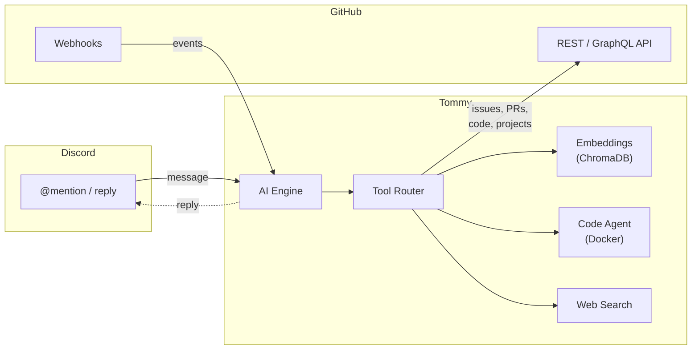

<p align="center">
  
</p>

<h1 align="center">Tommy</h1>

<p align="center">
  <strong>Your GitHub repo, managed from Discord.</strong><br>
  <sub>Issues, PRs, code reviews, project boards — one bot, zero tab-switching.</sub>
</p>

<p align="center">
  <a href="#-what-tommy-does">What it Does</a>&nbsp;&nbsp;|&nbsp;&nbsp;
  <a href="#-quick-start">Quick Start</a>&nbsp;&nbsp;|&nbsp;&nbsp;
  <a href="#%EF%B8%8F-ci-pipelines">CI Pipelines</a>&nbsp;&nbsp;|&nbsp;&nbsp;
  <a href="#-configuration">Configuration</a>&nbsp;&nbsp;|&nbsp;&nbsp;
  <a href="SETUP.md">Full Setup Guide</a>
</p>

<p align="center">
  
  
  
  
</p>

---

## What Tommy Does

Tommy sits in your Discord server and connects directly to your GitHub repo. Your team can manage the entire development workflow without leaving Discord.

<table>
<tr>
<td width="50%" valign="top">

### From Discord

- **Search issues & PRs** — find anything instantly
- **Create & edit issues** — with labels, assignees, milestones
- **Review PRs** — approve, comment, request changes
- **Search your codebase** — semantic search powered by embeddings
- **Ask questions** — Tommy knows your repo inside-out
- **Run code tasks** — autonomous coding in a sandboxed environment

</td>
<td width="50%" valign="top">

### From GitHub

- **Mention Tommy in issues/PRs** — get AI-powered responses
- **Auto-assign PR authors** — no manual busywork
- **AI code reviews** — catches bugs before humans do
- **Project management** — auto-categorize and label new issues
- **PR summaries** — generates changelogs with images, posts to Discord

</td>
</tr>
</table>

---

## See It in Action

```
You:    @Tommy what's the status of the auth refactor?

Tommy:  Found 2 related issues:
        - #89 — Auth middleware rewrite (in progress, assigned to @alice)
        - #92 — Session token migration (blocked on #89)
        And 1 open PR:
        - #95 — feat: new JWT middleware (3 files changed, 2 approvals)
```

```
You:    @Tommy create an issue: login page crashes on Safari

Tommy:  Created #103 — "Login page crashes on Safari"
        Labels: bug
        Assigned to: @you
```

```
You:    @Tommy review PR #95

Tommy:  Reviewed PR #95 — feat: new JWT middleware

        src/auth.py:42 — Token expiry should use UTC, not local time
        src/auth.py:78 — Missing error handling for malformed tokens
        tests/test_auth.py — Looks good, covers the main paths
```

---

## Quick Start

```bash
git clone https://github.com/your-org/tommy.git
cd tommy
python -m venv venv && source venv/bin/activate
pip install -r requirements.txt
cp .env.example .env          # fill in your tokens
python main.py                # that's it
```

You'll need a **Discord bot token** and a **GitHub App**. The [full setup guide](SETUP.md) walks you through every step — no experience required.

---

## How It Works



- **AI Engine** — configurable (Pollinations, OpenAI, or any OpenAI-compatible API)
- **Embeddings** — your entire codebase indexed for semantic search (local or API)
- **Code Agent** — runs code in a Docker sandbox, creates branches and PRs
- **Everything is configurable** — models, endpoints, and behavior in two config files

---

## CI Pipelines

Tommy ships with GitHub Actions that work on your repo automatically:

| Workflow | What it does |
|----------|-------------|
| **PR Assistant** | Mention `tommy` in any issue or PR comment to get AI help |
| **Code Review** | AI reviews PRs for bugs, security issues, and style |
| **Autofix** | Label an issue with `tommy` and the AI reads the codebase, fixes the bug, and opens a PR |
| **PR Author Assign** | Automatically assigns the PR author when opened |
| **Project Manager** | Categorizes new issues/PRs and adds labels |

All CI config lives in a single file: `.github/tommy.yml`. No hardcoded values in workflows.

---

## Configuration

Tommy uses **two config files** — one for the bot, one for CI:

| File | What it controls |
|------|-----------------|
| `config.json` | Bot name, your repo, admin users, AI model, embeddings, feature flags |
| `.github/tommy.yml` | CI trigger phrase, AI endpoints for pipelines, PR review settings, image generation |

Secrets (tokens, keys) go in `.env` — never committed to git.

> **Forking for your org?** Edit `config.json` and `.github/tommy.yml`, set your GitHub secrets, and you're done. See the [setup guide](SETUP.md) for details.

---

## Permissions

| Who | What they can do |
|-----|-----------------|
| **Everyone** | Search issues, PRs, code, docs, web. Read project boards. Ask questions. |
| **Admins** | All of the above + create/edit/close issues, merge PRs, run code agent, manage labels. |

Admins are defined by Discord role IDs and GitHub usernames in `config.json`.

---

<div align="center">
  <sub>Tommy is open source and self-hosted. Your code, your server, your rules.
  </sub>


  <sub>Built with ❤️ by <a href="https://github.com/elixpo">Elixpo</a>
  </sub>

</div>
